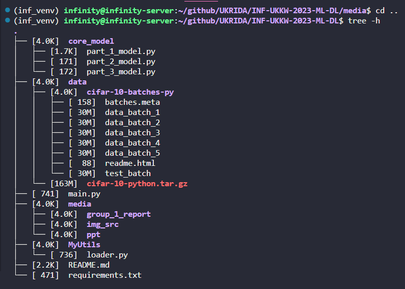

# Kelompok 3
412020001 - Nico Sanjaya
412020008 - Cristha Patrisya Pentury
412020009 - Yohanes Stefanus

# INF-UKKW-2023-ML-DL
This repository contains the code for the Machine Learning and Deep Learning course at Krida Wacana Christian University.

## Machine Learning and Deep Learning


## Table of Contents
* [Introduction](#introduction)
* [Pre-requisites](#pre-requisites)
* [Installation](#installation)
* [Usage](#usage)


## Introduction


## Pre-requisites
* Python3.8
* python3-pip
* python3-venv
* git

## Installation
* Clone the repository
```
git clone git@github.com:hendrikTpl/INF-UKKW-2023-ML-DL.git
```

* Change directory to the cloned repository
```
cd INF-UKKW-2023-ML-DL
```
* Create a virtual environment
```
python3 -m venv inf_venv
```

* Activate the virtual environment
```
source inf_venv/bin/activate
```

* Install the requirements
first install the pytorch and torchvision core packages
---> https://pytorch.org/get-started/locally/

### cpu only
```
pip install torch==1.12.1+cpu torchvision==0.13.1+cpu torchaudio==0.12.1 --extra-index-url https://download.pytorch.org/whl/cpu
```

### GPU Support
In this case, I use CUDA 10.2, In case you use different CUDA version, please refer to the pytorch website
```
## using pip
pip install torch==1.12.1+cu102 torchvision==0.13.1+cu102 torchaudio==0.12.1 --extra-index-url https://download.pytorch.org/whl/cu102
```

```
## using conda
conda install pytorch==1.12.1 torchvision==0.13.1 torchaudio==0.12.1 cudatoolkit=10.2 -c pytorch
```

Then install the requirements
```
pip install -r requirements.txt
```

## Project Structure



- core_model/ - contains the core model files
    - part1_model.py contains the core model for HW#1
    - part2_model.py contains the core model for HW#2
    - part3_model.py contains the core model for HW#3

- config/ - contains the experimental settings for HW#1, HW#2, and HW#3 
- data/ - contains the dataset
  
- media/ - contains the media files
    - img_src/ - contains the images
    - ppt/ - contains the ppt
    - group_name_report/ - contains the report files of your group


## Usage

# TODO

## HW#1 Indonsesian Street Food Classification
* [Dataset] Create a dataset of 3 Indonesian street food
    * label: 0 = Bakso, 1 = Batagor, 2 = Mie Ayam

## HW#2 Indonesian Street Food Generation
use the dataset from HW#1

## HW#3 Apply Pix2Pix to Indonesian Street Food Content Editing (Optional)
now you have a dataset of 3 Indonesian street food in HW#1, you will be asked to train a pix2pix model to generate new images of Indonesian street food. However, we need to convert the dataset to the pix2pix format (paired images). 


## Apply your own model to the production environment (Optional)

### Flask + Gunicorn + Nginx + PyTorch + Onnx
refer to this repository: https://github.com/hendrikTpl/Flask_PyTorch_DL 


